<div align="center">

<!-- BANNER: SVG animado com binários caindo estilo Matrix -->


<!-- Typing effect dinâmico -->
<a href="https://git.io/typing-svg">
  
</a>

</div>

---

<div align="center">

```
╔══════════════════════════════════════════════════════════════════╗
║                                                                  ║
║   ██████╗██╗  ██╗ ██████╗ ███████╗   ███████╗███████╗ ██████╗   ║
║  ██╔════╝██║  ██║██╔═══██╗██╔════╝   ██╔════╝██╔════╝██╔════╝   ║
║  ██║     ███████║██║   ██║███████╗   ███████╗█████╗  ██║         ║
║  ██║     ╚════██║██║   ██║╚════██║   ╚════██║██╔══╝  ██║         ║
║  ╚██████╗     ██║╚██████╔╝███████║██╗███████║███████╗╚██████╗   ║
║   ╚═════╝     ╚═╝ ╚═════╝ ╚══════╝╚═╝╚══════╝╚══════╝ ╚═════╝   ║
║                                                                  ║
║         [ Offensive Security  •  Low-Level Dev  •  OSINT ]       ║
║                                                                  ║
╚══════════════════════════════════════════════════════════════════╝
```

</div>

---

### `> whoami`

```python
#!/usr/bin/env python3

class SecurityResearcher:

    def __init__(self):
        self.name      = "Carlos"
        self.alias     = "c4o5.sec"
        self.role      = "Offensive Security Enthusiast"
        self.location  = "Brazil 🇧🇷"
        self.learning  = ["Malware Analysis", "Kernel Exploits", "Red Team Ops"]
        self.motto     = "Quebrando pra entender como funciona."

    def get_skills(self):
        return {
            "languages" : ["Python", "C", "Bash", "x86 Assembly"],
            "security"  : ["Pentesting", "OSINT", "Red Team", "Exploit Dev"],
            "systems"   : ["Linux", "Networking", "Reverse Engineering"],
            "tools"     : ["Metasploit", "Burp Suite", "Nmap", "Wireshark", "GDB"]
        }

    def current_focus(self):
        return [
            "🔬 Estudando análise de malware e engenharia reversa",
            "🛡️ Construindo honeypots e ferramentas de defesa",
            "⚔️ Desenvolvendo payloads e simulações ofensivas",
            "📡 Pesquisa em OSINT e coleta de inteligência"
        ]

me = SecurityResearcher()
```

---

### `> ls -la ./arsenal`

<p align="left">
  
  
  
  
  
  
</p>

<p align="left">
  
  
  
  
  
  
</p>

---

### `> cat /var/log/activity.log`

<div align="center">


</div>

<div align="center">


</div>

---

### `> cat ./areas_de_foco.txt`

```
┌─────────────────────────────────────────────────────────────────┐
│                                                                 │
│  🐍 Python     ─── automação, análise e ferramentas ofensivas  │
│  ⚙️  C          ─── programas de baixo nível e exploits         │
│  🐧 Bash/Linux ─── scripts, automação e ambiente Unix          │
│  🔒 Segurança  ─── honeypots, pentest e análise de vulns       │
│  🧭 OSINT      ─── coleta de intel e reconhecimento            │
│  ☠️  Red Team   ─── simulações ofensivas e evasão               │
│                                                                 │
└─────────────────────────────────────────────────────────────────┘
```

---

<div align="center">

### `> netstat -an | grep ESTABLISHED`

[](mailto:carlosincodeland@gmail.com)
[](https://github.com/CarlosInCodeLand)

---

```
[*] Session established.
[*] All modules loaded.
[*] Status: ONLINE
[*] "Quebrando pra entender como funciona."
```


</div>
